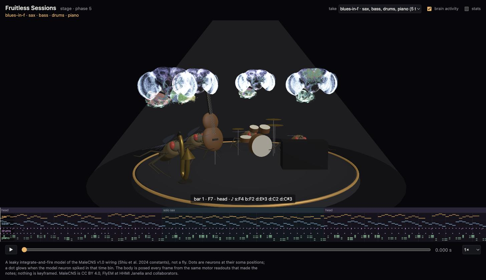

# Fruitless Sessions

Simulated fruit fly nervous systems, built from the Janelia FlyEM
[male CNS v1.0](https://male-cns.janelia.org/) connectome, playing together as a
jazz ensemble. The product is a static web page that plays a recorded set and,
in sync with the music, shows each fly's brain activity on its real neuron
anatomy next to a 3D animated fly playing its instrument.



Status: **phase 6, publishing**. Four flies, sax, bass, drums and piano,
play a blues and a free-style session together, coupled through their ears.
Each is the full 166,700-neuron brain: the courtship song circuit sings the
head, connectome-derived leg premotor pools walk the bass, wing motor neurons
beat the kit, the central complex heading ring names the key and the mushroom
body gates the pianist's touch. The page plays a take back with the audio as
the clock: brains lit by their spikes above procedural flies on one stage,
posed from the same motor readouts that made the notes.
See [`docs/plan.md`](docs/plan.md) for the plan and
[`docs/reference.md`](docs/reference.md) for the data facts it relies on.

## What this is, honestly

Every fly is the Shiu et al. 2024 leaky integrate-and-fire model run on the
166,700 neurons and 24.5 million signed connections of the MaleCNS release,
through Kisame76's [MLX engine](https://github.com/Kisame76/mlx-lif-engine).
The connectome gives wiring, synapse counts and predicted transmitter. It does
not give synaptic weights, time constants, neuromodulation or plasticity. One
global weight per synapse, fitted to the FlyWire female brain, is reused here
unchanged. Rhythm and harmony come from a conductor and from small, documented
readout functions, not from the neurons. It is a model of the wiring, not a fly.

## Setup

Apple silicon only (the engine is Metal). Tool versions are pinned in
`.tool-versions`; install them with `mise install`.

```bash
uv sync --extra dev
uv run fruitless fetch-data      # ~1.1 GB, three Feather tables, SHA-256 checked
uv run fruitless pack            # ~90 s, writes data/pack/male_cns_v1 (189 MiB)
uv run pytest                    # unit tests plus one GPU parity test
uv run fruitless smoke           # sweet taste drives MN9 for 1 s; writes takes/smoke/
uv run fruitless take tunes/blues-in-f/tune.yaml       # ~7 min: 72 s blues, four flies
uv run fruitless take tunes/fruitless-session-1/tune.yaml   # ~4 min: 44 s free style, no chart
uv run fruitless remap takes/blues-in-f                # re-map notes and audio without simulating
uv run fruitless bundle takes/blues-in-f               # -> stage/public/takes/blues-in-f
uv sync --extra meshes && uv run fruitless meshes stage/public/takes/smoke   # hero meshes
cd stage && npm install && npm run dev                 # http://localhost:5173/?take=blues-in-f
```

`fruitless select 'JO-A.*' 'JO-B.*'` lists the neurons a type regex selects.

## Publishing

Code and data travel separately. Merging to `main` builds the stage in CI
(`.github/workflows/pages.yml`) and deploys it to
https://fruitless-sessions.j6n.dev/ together with the takes on the data-only
`gh-pages` branch. The simulation needs Apple silicon, so the takes are
pushed from here whenever they change:

```bash
scripts/publish                  # force-pushes stage/public/takes to gh-pages, which redeploys
```

Soma
positions, superclass codes and hero meshes live once under
`stage/public/takes/shared` and `stage/public/takes/meshes`; each take adds
only its activity layers and audio (a four-fly 72 s blues is about 60 MB, the
shared store 58 MB).

## Reproducing a take

A take is a pure function of seed, tune, pack and engine commit. Every
`take.json` records a SHA-256 of each fly's per-neuron spike counts under
`counts_sha256`; run the same tune with the same seed and compare. The pack's
own array hashes and the source tables' hashes are in the bundle manifest
under `provenance`.

## Layout

```
src/fruitless/
  data/        release tables: lock file, fetch, annotations
  flies/       neuron selection by MaleCNS annotation; shared circuits
  sim/         Session: the engine's kernels, advanced one grid step at a time
  recording/   binned activity, hero meshes and take bundles the stage reads
  conductor/   tune files (chart, melody, form), the readout-to-note mapper, the take runner
  render/      deterministic additive synth, WAV, ffmpeg encode
  cli.py
tunes/         one directory per tune: tune.yaml plus a melody file
scripts/       publish; the stage has scripts/pose-check.ts for body work
stage/         the web page: Vite + TypeScript + three.js (src/body: fly, rig, instruments)
data/sources.lock.json   what bytes the tables are; copied into every take
docs/                    plan, reference, log
tests/
```

## Data and credit

MaleCNS v1.0 is CC BY 4.0: FlyEM at HHMI Janelia, the University of Cambridge,
the MRC Laboratory of Molecular Biology, Google Research and the MaleCNS
collaboration. Berg, Beckett, Costa, Schlegel et al., *Sexual dimorphism in the
complete Drosophila male central nervous system connectome*, Cell 2026.
Nothing from the release is redistributed in this repository.

The simulation engine is Kisame76's `mlx-lif-engine` (MIT). The model is Shiu
et al., *A Drosophila computational brain model reveals sensorimotor
processing*, Nature 2024.
